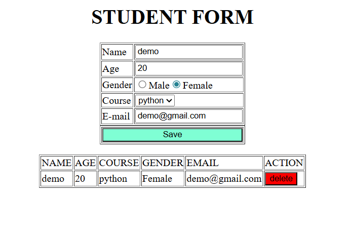

# 🎓 Student Registration Form

A simple web application built using **HTML, CSS, and JavaScript** that allows users to register student details and display them in a table dynamically.

---

## 🌐 Live Demo
https://todo-list-lake-alpha.vercel.app

---

## 📌 Features

- Add student details
- Display student data in a table
- Delete student records
- Dynamic DOM manipulation
- Simple and clean user interface

---

## 🛠 Technologies Used

- HTML
- CSS
- JavaScript

---

## 📂 Project Structure

```
todo-list/
│
├── index.html
├── Screenshot.png
└── README.md
```

## ▶ How to Run the Project

1. Download or clone the repository https://github.com/VaishnaviSuresh57/todo-list.git
2. Open the folder
3. Double click **index.html**
4. The project will run in your browser

---
## 📷 Screenshot

---

## 👩‍💻 Author

Vaishnavi S  
Computer Science Engineering Student

---
